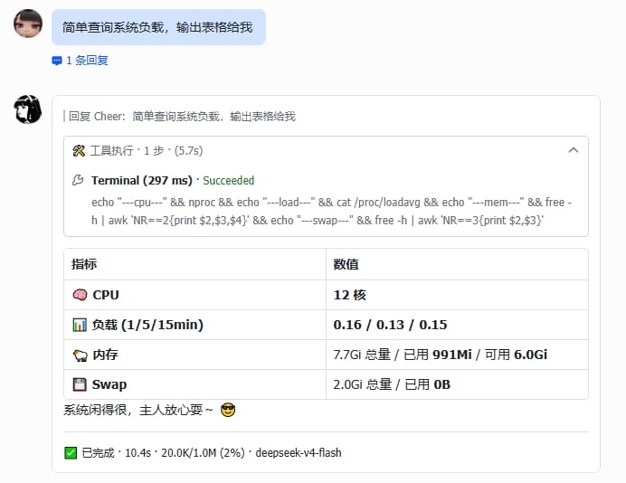

# Hermes Lark Streaming

[](https://github.com/Cheerwhy/hermes-lark-streaming/actions/workflows/test.yml)
[](https://github.com/Cheerwhy/hermes-lark-streaming/actions/workflows/hermes-check.yml)
[](LICENSE)

Real-time streaming card plugin for [Hermes](https://github.com/NousResearch/hermes-agent) Gateway via Feishu/Lark CardKit v2.0 — a `kind: platform` plugin that renders every turn as a typewriter-effect streaming card.

Inspired by [openclaw-lark](https://github.com/larksuite/openclaw-lark) and [hermes-feishu-streaming-card](https://github.com/baileyh8/hermes-feishu-streaming-card).

[中文](README.md)



---

## Distribution Model

Since v0.14.0 this plugin ships in exactly one form: a **Hermes platform plugin** (the self-contained `plugin/` directory, `kind: platform`). It subclasses the official `FeishuAdapter` and registers under the same `feishu` platform name (registry last-writer-wins). **No pip install** — copying the directory into `~/.hermes/plugins/` is the whole deployment.

> The legacy AST-injection form (hooking gateway sources) was archived in v0.14.0.
> Its full implementation lives under the git tag `archive/injection-mode`.

---

## Features

- **Streaming output** — replies render live in an interactive card, typewriter effect (CardKit v2 draft-streaming)
- **One card per turn** — reasoning, tool calls and the answer render in event order inside a single card
- **Reasoning panel** — thinking-model reasoning deltas stream into a collapsible panel (head/tail excerpted to stay under card size limits)
- **Tool panel** — structured tool events render live status icons and result blocks, step-capped
- **Interrupt opens a new card immediately** — on busy redirect the old card seals with a red banner and the new card opens at once, anchored to your correction message; reasoning/tools/answer all stream into it from the first millisecond
- **Cross-turn merge** — background turns, watcher notices and document deliveries merge into the most recent card
- **Clarify inline single-select** — clarification prompts render as Feishu button cards; a click resolves the callback
- **Heartbeat status line** — busy acks (↪ redirected / ⏳ queued) and progress text render in the card's status line until completion
- **Final card** — re-rendered on completion with token usage, duration, t/s and context stats
- **Cron cards** — scheduled-task results push as Feishu cards
- **Multi-profile** — under a multiplex gateway each profile gets its own engine and credentials
- **i18n** — card labels ship in English and Chinese, switched by the Feishu client locale

---

## Card Preview


---

## Requirements

- Hermes `>= 0.21.1` with the Feishu platform configured
- Feishu app scopes: card (CardKit) read/write, message send/reply, file upload
- Nothing to pip-install — the plugin is self-contained and only relies on the `lark-oapi` already present in the Hermes runtime

---

## Install

See [INSTALL.md](INSTALL.md) for the full walkthrough:

```bash
git clone https://github.com/Cheerwhy/hermes-lark-streaming.git
cp -R hermes-lark-streaming/plugin ~/.hermes/plugins/feishu-streaming

# config.yaml: plugins.enabled: [feishu-streaming-platform]
#             streaming.enabled: true
#             display.platforms.feishu.streaming: true

hermes gateway restart
python3 ~/.hermes/plugins/feishu-streaming/doctor.py
```

## Doctor (self-check)

A read-only diagnostic script shipped inside the plugin directory — zero install, stdlib only:

```bash
python3 ~/.hermes/plugins/feishu-streaming/doctor.py          # human-readable
python3 ~/.hermes/plugins/feishu-streaming/doctor.py --json   # CI/script friendly
```

It checks exactly the failure classes this project has historically hit silently:
both config switches, multiplex profile opt-outs, credentials (env / `.env`, values
never printed), plugin directory integrity and deploy drift, upstream hermes
contract anchors, runtime-venv `lark-oapi`, gateway process and wiring logs,
error signatures (card size / sequence / reply-target), and injection-mode residue.

---

## Configuration

In `~/.hermes/config.yaml`:

```yaml
plugins:
  enabled:
    - feishu-streaming-platform   # platform plugins are opt-in
streaming:
  enabled: true                   # master switch for the official draft transport
  transport: auto                 # auto/draft enables draft-streaming cards
  width_mode: default             # default / compact / fill
  header:
    enabled: false                # card header; abort red banner shows even when off
  body:
    text_size: normal_v2
  footer:
    enabled: true
    text_size: notation
    fields:
      - [status, elapsed, context, model]
    show_label: false
  panel_expanded: false
  clarify_inline: true
display:
  platforms:
    feishu:
      streaming: true             # official draft contract switch
      show_tool_use: true
      show_reasoning: true
```

Credentials are not configured here — the plugin reuses the official Feishu platform credentials (`FEISHU_APP_ID` / `FEISHU_APP_SECRET` env or `~/.hermes/.env`), bound per profile scope.

---

## Update

```bash
cd hermes-lark-streaming && git pull
rm -rf ~/.hermes/plugins/feishu-streaming
cp -R plugin ~/.hermes/plugins/feishu-streaming
hermes gateway restart
python3 ~/.hermes/plugins/feishu-streaming/doctor.py
```

## Uninstall

```bash
rm -rf ~/.hermes/plugins/feishu-streaming
# remove feishu-streaming-platform from plugins.enabled and restart —
# falls back to the bundled Feishu adapter (no streaming cards)
```

---

## How It Works

The plugin registers a `feishu` platform entry under the same name (last-writer-wins over the bundled adapter) and subclasses the official `FeishuAdapter` to implement the draft-streaming contract:

```
user message → turn starts (card created at probe time, replying to the user message)
  → send_draft full-snapshot frames → engine swaps the ANSWER segment (100ms throttled flush)
  → reasoning deltas / tool events → collapsible & tool panels update live
  → turn final → CardKit close + full re-render with footer stats
```

Key boundaries: a draft anchor change means a new turn (followup drain) → seal the old card green and open a new one; a ↪ redirect ack means the same turn was re-anchored → seal and open **immediately** (anchor taken from the ack's reply_to, i.e. the correction message); `message_id=None` background turns merge into the most recent card. Upstream contract anchors live in [`plugin/contract.py`](plugin/contract.py), guarded by three channels: pinned-revision regression in CI, a daily check against upstream main (auto-files an issue on break), and local `doctor.py`.

## Development

```bash
HERMES_PYTHON=~/.hermes/hermes-agent/venv/bin/python3

$HERMES_PYTHON -m ruff check plugin tests
$HERMES_PYTHON -m mypy
$HERMES_PYTHON -m pytest tests/ -q
```

## License

[MIT](LICENSE)
